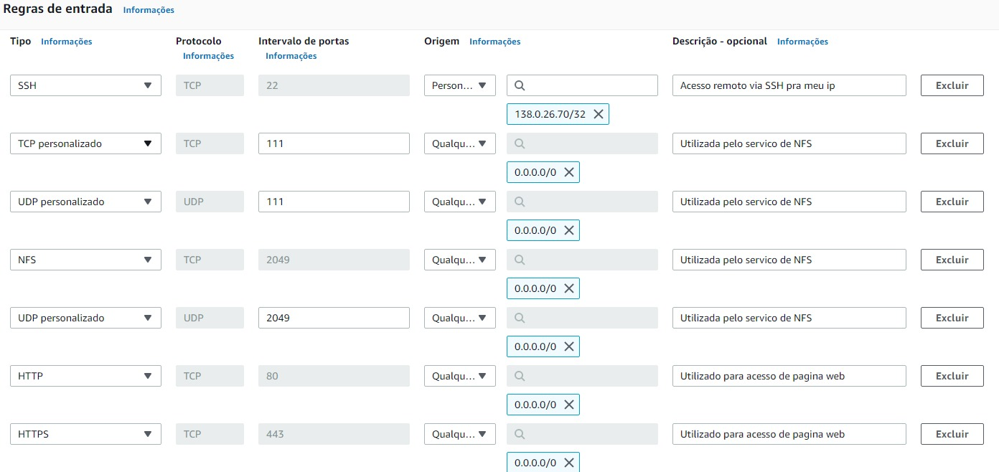

# Compass Uol - Atividade AWS/Linux

## Descrição da Atividade

Este repositório contém a atividade de Linux do programa de bolsas da Compass UOL. A atividade é individual e envolve a implementação de requisitos específicos relacionados ao Linux e AWS, conforme descrito a seguir:

### Requisitos AWS:
1. Criar uma chave pública para acesso ao ambiente.
2. Configurar uma instância EC2 com Amazon Linux 2 (Tipo t3.small, 16 GB SSD).
3. Alocar um Elastic IP e associá-lo à instância EC2.
4. Abrir as portas necessárias para acesso público: (22/TCP, 111/TCP e UDP, 2049/TCP/UDP, 80/TCP, 443/TCP).

### Requisitos no Linux:
1. Configurar o NFS fornecido.
2. Criar um diretório dentro do sistema de arquivos NFS com seu nome.
3. Instalar e configurar o Apache no servidor, garantindo que ele esteja ativo.
4. Desenvolver um script que verifica se o serviço está rodando e salva o resultado no diretório NFS.
5. O script deve registrar - Data e Hora + Nome do Serviço + Status + Mensagem personalizada de ONLINE ou OFFLINE.
6. O script deve criar dois arquivos de saída: um para o serviço online e outro para offline.
7. Configurar a execução automática do script a cada 5 minutos.
8. Versionar a atividade.
9. Documentar o processo de instalação do Linux.

---

### Índice
- [Descrição da Atividade](#descrição-da-atividade)
- [Configurações Iniciais na AWS](#configurações-iniciais-na-aws)
- [Gerar Par de Chaves para EC2](#gerar-par-de-chaves-para-ec2)
- [Criar a VPC](#criar-a-vpc)
- [Configurar Sub-Rede](#configurar-sub-rede)
- [Configurar o Gateway de Internet](#configurar-o-gateway-de-internet)
- [Configurar a Tabela de Roteamento](#configurar-a-tabela-de-roteamento)
- [Definir Regras de Segurança](#definir-regras-de-segurança)
- [Lançar a Instância EC2](#lançar-a-instância-ec2)
- [Associar IP Elástico à Instância EC2](#associar-ip-elástico-à-instância-ec2)
- [Configurar o NFS](#configurando-acesso-ao-nfs)
- [Instalar e Configurar o Apache](#configurando-o-apache)

---

## Passo a Passo de Implementação

### Configurações Iniciais na AWS
- Utilização de uma nova VPC para organização.
- Criação de um novo grupo de segurança.
- Configuração de uma nova sub-rede.
- Configuração de um gateway de internet.
- Detalhamento a seguir.

### Gerar Par de Chaves para EC2
Esta etapa é fundamental para o acesso remoto à instância EC2.

- Acesse o serviço EC2 na AWS e clique em "Pares de chaves" no menu à esquerda.
- Clique em "Criar par de chaves".
- Nomeie a chave.
- Selecione o formato do arquivo como .pem para acesso via CMD.
- Clique em "Criar par de chaves".
- Salve o arquivo .pem gerado em um local seguro.

### Criar a VPC
- Acesse o serviço VPC na AWS, clique em "Suas VPCs" no menu à esquerda e depois em "Criar VPC".
- Selecione "Somente VPC" para configurar manualmente.
- Nomeie a VPC.
- Escolha "Entrada manual de CIDR IPv4" e insira 10.0.0.0/16.
- Deixe o bloco CIDR IPv6 como "Nenhum Bloco CIDR IPv6".
- Clique em "Criar VPC".

### Configurar Sub-Rede
- Acesse o serviço VPC na AWS, clique em "Sub-redes" no menu à esquerda e depois em "Criar Sub-rede".
- Selecione a VPC criada anteriormente.
- Nomeie a sub-rede.
- Escolha a zona de disponibilidade us-east-1a.
- Insira 10.0.1.0/24 como o bloco CIDR IPv4 da sub-rede.
- Clique em "Criar Sub-rede".

### Configurar o Gateway de Internet
- Acesse o serviço VPC na AWS, clique em "Gateways de internet" no menu à esquerda e depois em "Criar gateway de internet".
- Nomeie.
- Clique em "Criar gateway de internet".
- Selecione o gateway criado, clique em "Ações" e depois em "Associar à VPC".
- Escolha a VPC criada anteriormente e clique em "Associar".

### Configurar a Tabela de Roteamento
- Acesse o serviço VPC na AWS, clique em "Tabelas de rotas" no menu à esquerda e depois em "Criar tabela de rotas".
- Nomeie.
- Associe a tabela à VPC criada anteriormente.
- Selecione a tabela de rotas criada, clique em "Ações" e depois em "Editar rotas".
- Adicione uma rota com os seguintes valores:
  - Destino: 0.0.0.0/0
  - Alvo: selecione o gateway de internet criado anteriormente.
- Clique em "Salvar" para concluir a configuração do tráfego de internet.

### Definir Regras de Segurança
- Acesse o serviço EC2 na AWS, clique em "Segurança" e depois em "Grupos de segurança" no menu à esquerda.
- Clique em "Criar grupo de segurança".
- Nomeie o grupo de segurança.
- Adicione a descrição para organização.
- Associe à VPC criada anteriormente.
- Configure as regras de entrada clicando em "Adicionar nova regra" e adicionando as seguintes 7 regras:



### Lançar a Instância EC2
- Acesse o serviço EC2 na AWS, clique em "Instâncias" e depois em "Executar Instância".
- Na seção de nomes e tags, use os valores padrão (Name, Project e CostCenter) para instâncias e volumes.
- Escolha a imagem Amazon Linux 2 AMI (HVM), SSD Volume Type.
- Selecione t3.small como o tipo de instância.
- Selecione a chave gerada anteriormente.
- Na configuração de rede, clique em "Editar" e verifique se a VPC e a sub-rede criadas estão selecionadas.
- Na seção de firewall, escolha "Selecionar grupo de segurança existente" e selecione.
- Para armazenamento, defina o tamanho como 16 GB gp2 (SSD).
- Clique em "Executar Instância".

### Associar IP Elástico à Instância EC2
Para que uma instância tenha um endereço IPv4 público estático, é necessário associar um IP elástico a ela.
- Acesse o serviço EC2 na AWS, clique em "IPs elásticos" no menu à esquerda.
- Clique em "Alocar endereço IP elástico".
- Selecione o IP alocado, clique em "Ações" e depois em "Associar endereço IP elástico".
- Escolha a instância EC2 criada anteriormente e clique em "Associar".

### Configurando acesso ao NFS
O NFS é uma solução de armazenamento em rede amplamente utilizada para compartilhar dados na rede. Na AWS, esse serviço é fornecido pelo EFS (Elastic File System).

- Primeiro modo, vamos atualizar o sistema e instalar os utilitários do NFS:
  - `sudo yum update -y` 
  - `sudo yum install -y nfs-utils`

- Feito isso, vamos criar um diretório para o NFS, utilizando o comando:
  - `sudo mkdir -p /nfs/gabriel`

- Após criar o diretório, vamos configurar as permissões do diretório:
  - `sudo chown nobody:nobody /nfs/gabriel`
  - `sudo chmod 777 /nfs/gabriel`

- Feito isso, vamos configurar o compartilhamento do NFS da seguinte forma:
  - `echo "/nfs/gabriel *(rw,sync,no_root_squash,no_subtree_check)" | sudo tee -a /etc/exports`

- Depois, expostei os sistemas de arquivo utilizando o comando:
  - `sudo exportfs -a`
  
- E finalizando a parte do NFS, iniciei e habilitei os serviços dele utilizando os comandos:
  - `sudo systemctl start nfs-server`
  - `sudo systemctl enable nfs-server`

### Configurando o Apache
- Primeiro utilizei o comando para instalar o apache:
  - `sudo yum install -y httpd`

- Após isso, iniciei e habilitei os serviços do apache:
  - `sudo systemctl start httpd`
  - `sudo systemctl enable httpd`

- Feito isso, criei um diretório para o script:
  - `sudo mkdir -p /usr/local/bin/`

- Agora, criei um script para validação:
  ```bash
  sudo nano /usr/local/bin/verifica_apache.sh

  #!/bin/bash
  DIR_NFS="/nfs/gabriel"
  DATE=$(date '+%Y-%m-%d %H:%M:%S')
  SERVICE="httpd"
  STATUS=$(systemctl is-active $SERVICE)

  if [ "$STATUS" == "active" ]; then
    MESSAGE="ONLINE"
    echo "$DATE $SERVICE $STATUS $MESSAGE" >> $DIR_NFS/online.log
  else
    MESSAGE="OFFLINE"
    echo "$DATE $SERVICE $STATUS $MESSAGE" >> $DIR_NFS/offline.log
  fi

- Após isso, tornei o script executável utilizando o comando:
  - `sudo chmod +x /usr/local/bin/verifica_apache.sh`

- Feito isso, configurei o cron para que o script seja executado automaticamente a cada 5 minutos com privilégios de root:
  - `sudo crontab -e`
  
Código de configuração do cron:
  - `*/5 * * * * /usr/local/bin/verificar_apache.sh`
    

### Conclusão
Com essas etapas está finalizada a configuração. Uma maneira de verificar se o Apache está funcionando corretamente é acessar o IP público da instância e verificar se a página do Apache é exibida.
